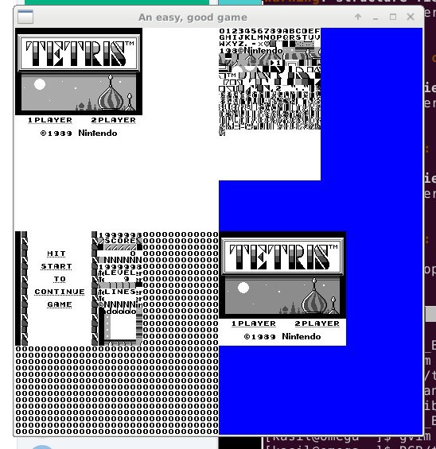
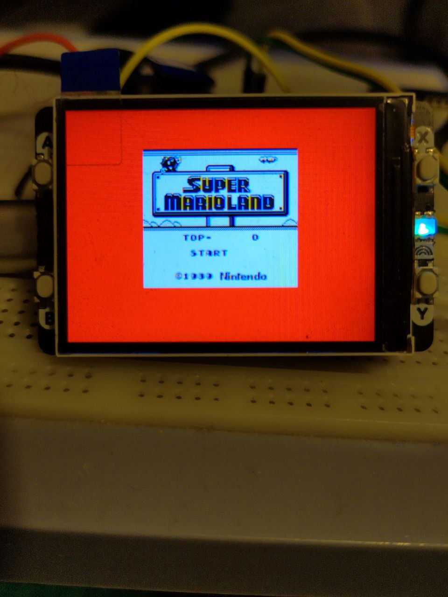

# RGB Rusty GameBoy

Gameboy Emulator written in Rust

Currently the PC version works with some games
The RP-pico branch can not play games yet, the Video Rendering works

## The pc version showing the title screen of Tetris in the lower Right corner the other corners show the content of Video Ram

## The Raspberry Pi pico versin showing the title screen of super mario land.

